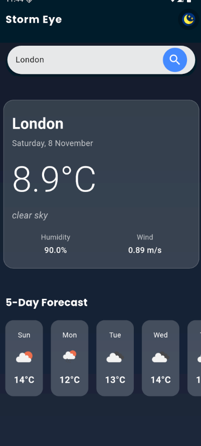
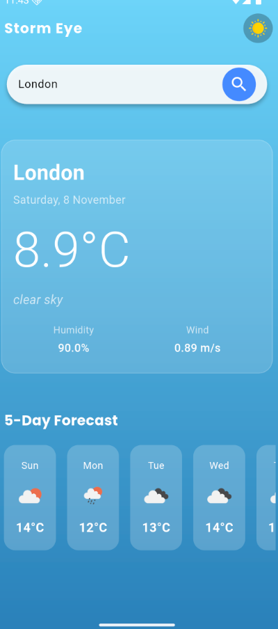

# 🌩️ Strom Eye

Strom Eye is a simple yet elegant Flutter weather app that shows real-time weather updates and forecasts in a beautiful, minimal interface.  
It’s built as a personal learning project to improve my Flutter skills and UI design sense.

---

## ✨ Features

- 🌦️ Current weather with temperature, humidity, and condition icons  
- 🕒 5-day forecast display  
- 📍 Search weather by city  
- 🎨 Modern and responsive design  
- ⚡ Smooth animations and transitions  

Up coming Features: background animation, better desgin and ...
---

## 📸 Screenshots

| Home Screen | Forecast Screen |
|--------------|----------------|
|  |  |

---

## 🧰 Tech Stack

- Framework: Flutter  
- Language: Dart  
- API: OpenWeatherMap (REST API)  
- State Management: Provider (or similar)
